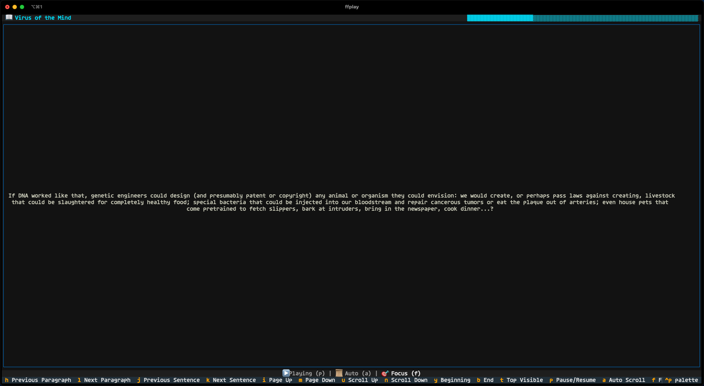

<div align="center">

  ### Lue AI — Terminal eBook Reader with Text-to-Speech

  A fast, cross-platform terminal eBook reader with seamless TTS, a rich Textual UI, smooth, flicker-free reading, and a built-in AI assistant (press `?`) that answers questions about the current passage (requires `GEMINI_API_KEY`).

  [](https://www.gnu.org/licenses/gpl-3.0)
  [](https://www.python.org/downloads/)
  [](https://github.com/superstarryeyes/lue)

  [Features](#-features) • [Quick Start](#-quick-start) • [Installation](#-installation) • [Usage](#-usage) • [Development](#-development)

  

</div>

---

## ✨ Features

| **Feature**                             | **Description**                                                                                |
| --------------------------------------- | ---------------------------------------------------------------------------------------------- |
| **📖 Multi-Format Support**             | Support for EPUB, PDF, TXT, DOCX, DOC, HTML, RTF, and Markdown with seamless format detection  |
| **👄 Modular TTS System**               | Edge TTS (default), Apple TTS (macOS native), Google TTS (Cloud AI), ElevenLabs TTS (AI voices), and Kokoro TTS (local/offline) with extensible architecture |
| **🌌 Rich Terminal UI**                 | Clean, responsive interface with customizable color themes and full mouse & keyboard support   |
| **🤖 AI-Assisted Reading**              | Interactive AI assistant to answer questions about your reading content using Google Gemini API |
| **💾 Smart Persistence**                | Automatic progress saving, state restoration, and cross-session continuity for seamless reading|
| **🌍 Cross-Platform & Multilingual**    | Full support for macOS, Linux, Windows with 100+ languages and consistent global experience    |
| **⚡️ Fast Navigation**                  | Intuitive shortcuts, flexible controls, and smooth scrolling for efficient book navigation     |

---

## 🚀 Quick Start

> **Want to try Lue right away?** Follow these simple steps:

```bash
# 1. Install FFmpeg (required for audio processing)
# macOS
brew install ffmpeg
# Ubuntu/Debian  
sudo apt install ffmpeg
# Windows: Download from ffmpeg.org and add to PATH

# 2. Clone and setup
git clone https://github.com/superstarryeyes/lue.git
cd lue
pip install -r requirements.txt

# 3. Start reading!
python -m lue sample.txt
```

> **📝 Note:** Quick start uses Edge TTS (requires internet). For offline capabilities, see [full installation](#-installation).

---

## 📦 Installation

### Prerequisites

#### Core Requirements
- **FFmpeg** - Audio processing (required)

#### Optional Dependencies  
- **espeak** - Kokoro TTS support
- **antiword** - .doc file support

#### macOS (Homebrew)
```bash
brew install ffmpeg
# Optional
brew install espeak antiword
```

#### Ubuntu/Debian
```bash
sudo apt update && sudo apt install ffmpeg
# Optional  
sudo apt install espeak antiword
```

#### Windows
Download FFmpeg from [ffmpeg.org](https://ffmpeg.org/download.html) and add to PATH.

### Install Lue

#### Standard Installation

```bash
# 1. Clone repository
git clone https://github.com/superstarryeyes/lue.git
cd lue

# 2. Install dependencies
pip install -r requirements.txt

# 3. Install Lue
pip install .
```

#### Enable Kokoro TTS (Optional)

For local/offline TTS capabilities:

```bash
# 1. Install system dependencies
brew install ffmpeg espeak-ng                       # on Mac 🍏
# sudo apt install ffmpeg espeak-ng                 # on Ubuntu/Debian 🐧

# 2. Edit requirements.txt - uncomment Kokoro package:
kokoro>=0.9.4

# 3. Install updated requirements
pip install -r requirements.txt

# 4. Install Lue
pip install .
```

Kokoro voices: https://huggingface.co/hexgrad/Kokoro-82M/blob/main/VOICES.md

#### Enable Apple TTS (macOS Only)

For native macOS speech synthesis (no additional installation required):

```bash
# Apple TTS is automatically available on macOS systems
# Uses the built-in 'say' command with system voices

# List available voices:
say -v '?'

# Use Apple TTS with a specific voice:
lue --tts apple --voice "Samantha" path/to/your/book.epub
```

#### Enable Google Cloud TTS (Optional)

For Google's high-quality Cloud Text-to-Speech:

```bash
# 1. Install Google Cloud TTS package
pip install google-cloud-texttospeech

# 2. Set up Google Cloud credentials
# Create a service account key at: https://console.cloud.google.com/iam-admin/serviceaccounts
export GOOGLE_APPLICATION_CREDENTIALS="/path/to/your/service-account-key.json"

# 3. Use Google TTS with a specific voice:
lue --tts google --voice "en-US-Wavenet-D" path/to/your/book.epub
```

#### Enable ElevenLabs TTS (Optional)

For high-quality AI voice synthesis:

```bash
# 1. Install ElevenLabs package
pip install elevenlabs

# 2. Set your API key (get it from https://elevenlabs.io/app/developers/api-keys)
export ELEVENLABS_API_KEY="your_api_key_here"

# Or alternatively, set it in config.py:
# ELEVENLABS_API_KEY = "your_api_key_here"
```

#### Enable AI Assistant (Optional)

For AI-powered reading assistance using Google Gemini:

```bash
# 1. Get a Gemini API key from Google AI Studio
# Visit: https://makersuite.google.com/app/apikey

# 2. Set your API key as an environment variable
export GEMINI_API_KEY="your_gemini_api_key_here"

# 3. The AI assistant will be available with the ? key during reading
```

---

## 💻 Usage

### Basic Commands

```bash
# Start with default TTS
lue path/to/your/book.epub

# Use specific TTS model  
lue --tts apple path/to/your/book.epub
lue --tts google path/to/your/book.epub
lue --tts kokoro path/to/your/book.epub
lue --tts elevenlabs path/to/your/book.epub

# Use a specific voice (full list at VOICES.md)
lue --voice "en-US-AriaNeural" path/to/your/book.epub

# Specify a language code if needed
lue --lang a path/to/your/book.epub

# Seconds of overlap between sentences
lue --over 0.2 path/to/your/book.epub

# Enable PDF cleaning filter (removes page numbers, headers and footnotes)
lue --filter path/to/your/book.pdf

# View available options
lue --help
```

### Keyboard Controls

<div align="center">

| **Key Binding**                         | **Action Description**                                                                         |
| --------------------------------------- | ---------------------------------------------------------------------------------------------- |
| `q`                                     | Quit the application and save current reading progress automatically                           |
| `p`                                     | Pause or resume the text-to-speech audio playback                                              |
| `a`                                     | Toggle auto-scroll mode to automatically advance during TTS playback                           |
| `t`                                     | Select and highlight the top sentence of the current visible page                              |
| `h` / `l`                               | Move the reading line to the previous or next paragraph in the document                        |
| `j` / `k`                               | Move the reading line to the previous or next sentence in the document                         |
| `i` / `m`                               | Jump up or down by full pages for rapid navigation through longer documents                    |
| `u` / `n`                               | Scroll up or down by smaller increments for fine-grained position control                      |
| `y` / `b`                               | Jump directly to the beginning or end of the document for quick navigation                     |
| `c`                                     | Open table of contents to navigate between chapters                                            |
| `?`                                     | Open AI assistant to ask questions about the current reading content                           |

</div>

### Table of Contents Navigation

When the table of contents is open (press `c`):

| **Key Binding**                         | **Action Description**                                                                         |
| --------------------------------------- | ---------------------------------------------------------------------------------------------- |
| `↑` / `↓`                               | Navigate up or down through the chapter list                                                   |
| `Enter`                                 | Jump to the selected chapter and close the table of contents                                   |
| `Esc` / `c` / `q`                       | Close the table of contents and return to reading                                              |

### AI Assistant

When the AI assistant is open (press `?`):

| **Key Binding**                         | **Action Description**                                                                         |
| --------------------------------------- | ---------------------------------------------------------------------------------------------- |
| `Enter`                                 | Send your question to the AI assistant and get an answer about the current content            |
| `Ctrl+U`                                | Clear the current input text in the assistant                                                  |
| `Esc`                                   | Close the AI assistant and return to reading                                                   |

The AI assistant automatically uses the currently highlighted sentence as context for your questions. You can ask about:
- **Content explanation** - "What does this mean?"
- **Character analysis** - "Who is this character?"
- **Plot clarification** - "What happened in this scene?"
- **Thematic discussion** - "What is the main theme here?"
- **Historical context** - "When did this take place?"

> **📝 Note:** AI assistant requires a `GEMINI_API_KEY` environment variable. See [installation instructions](#enable-ai-assistant-optional) above.

### Mouse Controls

- **🖱️ Click** - Jump to sentence
- **🔄 Scroll** - Navigate content  
- **📍 Progress bar click** - Jump to position

---

## 🧩 Development

> **Interested in extending Lue?** 

Check out the [Developer Guide](DEVELOPER.md) for instructions on adding new TTS models and contributing to the project.

### Data Storage

**Reading Progress:**
- **macOS:** `~/Library/Application Support/lue/`
- **Linux:** `~/.local/share/lue/`  
- **Windows:** `C:\Users\<User>\AppData\Local\lue\`

**Error Logs:**
- **macOS:** `~/Library/Logs/lue/error.log`
- **Linux:** `~/.cache/lue/log/error.log`
- **Windows:** `C:\Users\<User>\AppData\Local\lue\Logs\error.log`

---

## 📄 License

This project is licensed under the **GPL-3.0 License** - see the [LICENSE](LICENSE) file for details.

---

## 🛠️ Contributing

Contributions are welcome! Please feel free to submit a Pull Request.

<div align="center">

---

*Made with 💖 for CLI enthusiasts and bookworms*

**[⭐ Star this repo](https://github.com/superstarryeyes/lue)** if you find it useful!

</div>
